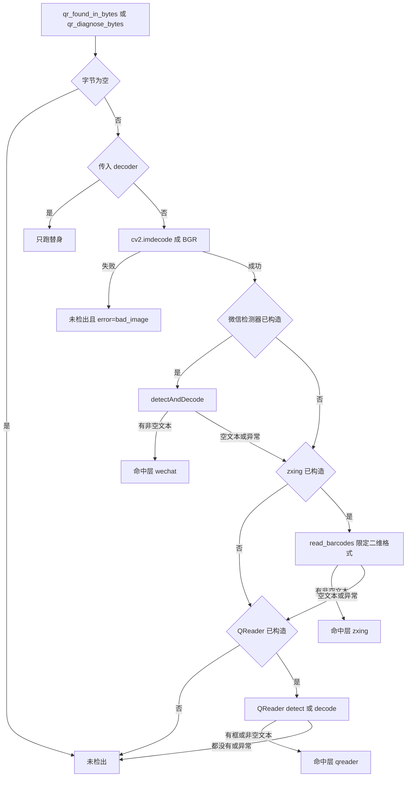

# 微信优先的三级二维码解码

Feature Name: forbidden-qr-wechat
Updated: 2026-10-10

## Description

热路径从「只跑 QReader」改成三级本地解码。第一级是 OpenCV contrib 的 `WeChatQRCode`，第二级是 `zxing-cpp`，第三级是已经装在容器里的 QReader。前一级检出后不调用后面的级，因此常见码不会再等 QReader 的检测模型。

微信层和 zxing 层必须解出非空文本。QReader 保持现有口径：有检测框，或有非空文本，都算检出。这样「有框没文本」仍能由最后一级兜住，但只在前两级未检出时才付出模型成本。

图片、短视频帧和图片检测测试继续调用现有函数。处置、OCR、触发词和模型顺序不改。测试页增加命中层和三个分层状态，并把「框数量」改成「检出数量」。

本机对照只用了一张低对比 QQ 群码，载荷是 `https://qm.qq.com/q/u4KmGYq3cs`。这张图上 QReader `detect` 中位 243 毫秒，微信检测器中位 29 毫秒。微信检测器在人为 15 像素运动模糊下未解出，其余对照与 QReader 一致。OpenCV 自带 `QRCodeDetector` 和裸 pyzbar 解不出这张图。拍摄的实体码没有测过。zxing-cpp 没有参加那轮计时，只作为第二级文本兜底。

## Architecture



两个调用方不改入口：

- 图片路 `qr_found_in_b64`，短视频帧 `qr_found_in_bytes`。它们只要布尔值。
- 图片检测测试 `qr_diagnose_bytes`。它要引擎状态、命中层和截断载荷。

`rsync` 部署不会执行 `requirements.txt`。容器里缺前两级时，已安装的 QReader 仍作为第三级使用。三级都缺时插件仍要能加载，二维码层返回未检出。安装步骤写在本文「部署注意」，不写进插件代码。

## Components and Interfaces

### 对外函数

`business/forbidden_qr.py` 保留这些签名：

- `qr_found_in_bytes(data, decoder=None) -> bool`
- `qr_found_in_b64(raw, decoder=None) -> bool`
- `qr_engine_state() -> str`
- `qr_diagnose_bytes(data, decoder=None) -> dict`

热路径内部改为按三级顺序调用。QReader 的加载函数保留，但只在前两级都未检出时调用。未走到第三级时，不导入 `qreader`，也不构造 `QReader()`。

诊断字典在原字段上增加四个键：

| 字段 | 类型 | 含义 |
| --- | --- | --- |
| `engine` | str | 总状态。至少一个解码器构造成功为 `ready` |
| `wechat` | str | 微信分层状态 |
| `zxing` | str | zxing 分层状态 |
| `qreader` | str | QReader 分层状态。本张图未走到第三级时，报当前加载状态，不为此触发加载 |
| `layer` | str | `wechat`、`zxing`、`qreader` 或空字符串 |
| `found` | bool | 三级里是否有一级检出 |
| `box_count` | int | 命中层的检出数量。名字保留，避免旧页面读不到字段 |
| `payloads` | list | 命中层的非空文本，每条截断 120 字，最多 3 条。只有框没有文本时为空列表 |
| `error` | str | 异常类型名、`bad_image`、`empty_image` 或空字符串。不含图片字节 |

`box_count` 统计截断前的数量。`payloads` 仍只留前 3 条。替身路径的 `engine` 仍报 `ready`，`layer` 和三个分层状态报空字符串。替身不代表真实引擎已加载。

未走到的后级不因为诊断而提前加载。诊断里的后级状态只反映已经发生过的加载；还没加载过时，该层状态报空字符串，不报 `missing`。热路径布尔函数同样不提前加载后级。`qr_engine_state()` 可以加载全部三级，因为它的用途就是回答当前能不能解码。

### 分层加载

每个解码器单独懒加载，失败互不影响。

- 导入失败：该层 `missing`，本进程不再导入。
- 导入成功但构造失败：该层 `init_failed`，本进程不再构造。
- 构造成功：该层 `ready`，复用同一个实例。

总状态按 requirements 的优先级计算：有 `ready` 就是 `ready`；否则有 `init_failed` 就是 `init_failed`；否则是 `missing`。这个计算只统计已经尝试过的级。三级都还没尝试时，`qr_engine_state()` 负责触发加载。总状态不是 `ready` 时，沿用现在的一次 warning，文案仍是 `[rules] qr engine not ready state=%s`。

微信检测器的构造固定为：

```python
cv2.wechat_qrcode.WeChatQRCode()
```

不传检测模型和超分模型路径。容器里的 OpenCV 是 5.0.0，这个类的无参构造会使用 contrib 自带模型。4.x 的四参数写法不移植。`cv2.wechat_qrcode` 不存在，记为微信层 `missing`，不是构造失败。

zxing-cpp 没有单独的权重对象。成功导入 `zxingcpp` 后，该层就是 `ready`。

QReader 沿用现有加载结果：导入失败是 `missing`，`QReader()` 抛异常是 `init_failed`。权重加载失败不再被写成「没装库」。

### 图像与调用

字节先走 `cv2.imdecode`，得到 BGR 数组。微信层和 zxing 层共用这一份数组。QReader 仍要 RGB 数组；只有走到第三级时才从同一份 BGR 转 RGB，前两级命中时不做这次转换。`imdecode` 失败时诊断 `error` 为 `bad_image`，三级都不调用。

微信层调用 `detectAndDecode(image)`。返回的文本序列里，去空白后非空的项才算检出。定位点没有对应文本时忽略，然后进入 zxing 层。

zxing 层一次调用 `zxingcpp.read_barcodes`。格式参数只包含：

- `BarcodeFormat.QRCode`
- `BarcodeFormat.MicroQRCode`
- `BarcodeFormat.RMQRCode`
- `BarcodeFormat.Aztec`
- `BarcodeFormat.DataMatrix`
- `BarcodeFormat.PDF417`

当前绑定没有某个枚举时，跳过该枚举，不因此让整层失败。不设置 `try_harder`、`try_rotate`、`try_invert`。返回项必须格式在上述集合内，且 `text` 去空白后非空。EAN、UPC、Code 128、Code 39、ITF、Codabar 即使库默认会认，本功能也不传入、不采纳。这些一维码会出现在普通商品照片上，认下来会把普通图片判成二维码违禁。

QReader 层沿用现有 `_reader_hit`：有 `detect` 就看框；没有 `detect` 才看非空文本。有框没文本也算检出，`payloads` 可以为空，`box_count` 取框数。

一层抛异常时，诊断 `error` 记录该层异常类型名，然后继续下一层。后一层检出时 `found` 仍为真，`error` 保留前面失败层的类型名，方便页面看到兜底原因。三级都异常时 `found` 为否，`error` 保留最后一层的类型名。

### 页面

`dashboard/src/forbidden-image-test-view.tsx` 的二维码区在引擎总状态为 `ready` 时显示：

- 引擎状态
- 微信分层状态
- zxing 分层状态
- QReader 分层状态
- 是否检出
- 命中层：`wechat` 显示「微信」，`zxing` 显示「zxing」，`qreader` 显示「QReader」，空字符串显示「无」
- 检出数量
- 截断载荷

分层状态为空字符串时显示「本次未加载」，不显示成 `missing`。引擎总状态不是 `ready` 时，是否检出仍显示「二维码引擎未加载，本次未识别」。这一状态下展示三个分层状态，检出数量和载荷显示「本次未识别」。类型 `ImageQrDiagnosis` 增加 `wechat`、`zxing`、`qreader`、`layer` 四个可选字符串。旧的「框数量」标签删除。

### 依赖

`requirements.txt` 改为：

```text
qreader
opencv-contrib-python
zxing-cpp
rapidocr
onnxruntime
```

不写版本号，和当前文件的写法一致。插件代码不调用 pip，也不在启动时检查后自动安装。

### 不改的部分

- `business/forbidden_image.py` 的处置顺序和 `inspect_uploaded_image` 的入参。它继续把 `qr_diagnose_bytes` 的字典放进 `qr`。
- `business/forbidden_video.py` 的抽帧数量、时长门槛和 `qr_found_in_bytes` 调用。
- OCR、触发词、模型、撤回、禁言、飞书和违禁日志。
- 测试页的文件类型、8MB 上限，以及不提交 `qr_found` 的约定。
- QReader 有框即检出的口径。它只从唯一一级降为第三级。

## Data Models

没有新表，没有新配置项。进程内保留三个解码器实例、各自的加载标志和一次 warning 标志。这些状态不落盘。

诊断字典是页面契约。除新增的 `wechat`、`zxing`、`qreader`、`layer` 外，原有五键都保留。

## Correctness Properties

1. 空字节在替身和真实解码器之前返回未检出。
2. 传入 `decoder` 时，三级真实解码器的导入函数都不被调用。
3. 微信层已有非空文本时，zxing 和 QReader 的读取函数不被调用，`qreader` 模块也不被导入。
4. zxing 层已有非空文本时，QReader 不被构造。
5. 微信层只有定位点、没有非空文本时，不在微信层检出，继续后级。
6. zxing 返回的一维码不增加 `box_count`，也不写入 `payloads`。
7. QReader 有框、载荷为空时，`found` 为真，`layer` 为 `qreader`，`payloads` 为空列表。
8. 一个解码器构造失败不影响另一个解码器继续尝试。
9. `payloads` 每条最多 120 字，最多 3 条；`error` 只有类型名或固定短原因。

## Error Handling

| 场景 | 热路径 | 诊断 |
| --- | --- | --- |
| 空字节 | 未检出 | `error=empty_image`，不加载引擎 |
| 字节不是图片 | 未检出 | `error=bad_image` |
| 三级都未安装 | 未检出，一次 warning | `engine=missing` |
| 库已导入但都构造失败 | 未检出，一次 warning | `engine=init_failed` |
| 只有部分级可用 | 按顺序只用已构造的级 | `engine=ready`，缺的级保留自己的状态 |
| 前一级异常 | 继续下一已构造级 | `error` 保留失败级的异常类型名 |
| 三级都异常或都未检出 | 未检出 | `layer` 为空字符串 |
| 替身抛异常 | 未检出 | `engine=ready`，`error` 为异常类型名 |

缺库、坏图和解码异常都不处置消息。

## Test Strategy

单测继续注入替身，不下载模型，不要求本机安装 OpenCV contrib 或 zxing-cpp。现有对 `_qreader` 和 `qreader` 模块的打桩保留给第三级，并加上前两级加载函数的打桩。

至少覆盖：

- 微信层返回非空文本时不调用 zxing，也不导入 QReader。
- 微信层返回空文本或抛异常时才调用 zxing。
- zxing 返回非空文本时不构造 QReader。
- zxing 的一维码结果被丢弃。
- 微信层只有定位点时继续后级。
- QReader 有框、文本为空时检出，命中层为 `qreader`。
- 一个层 `missing`、另一个层 `ready` 时总状态为 `ready`。
- 三级都导入失败时总状态为 `missing`，warning 只出现一次。
- 替身路径不读取真实加载函数。
- `qr_found_in_b64` 仍接受缺末尾 `=` 的 base64。
- 页面源码含「命中层」「检出数量」，不含「框数量」。
- `requirements.txt` 同时含 `qreader`、`opencv-contrib-python`、`zxing-cpp`。

真实图片对照不放进单测。部署到 thinkpad 后，用现有那张 QQ 群码手动打开图片检测测试页，期望命中层为微信且载荷前缀为 `https://qm.qq.com/`。这一步不属于本仓库的自动测试。

实现时函数保持在 50 行以内。三级加载、三级调用和诊断拼装分开写。

## 部署注意

本仓库的 thinkpad 同步是本地 `rsync`，不会在容器里执行 `pip install -r requirements.txt`。代码合并或同步后，仍要在 `astrbot` 容器里安装 `opencv-contrib-python` 和 `zxing-cpp`，然后重启容器。`qreader` 已经在当前容器里，本功能不卸载它。

容器里已经有 `cv2 5.0.0`。若 `cv2.wechat_qrcode` 不存在，说明当前装的是不含 contrib 的 OpenCV，需要换成 `opencv-contrib-python`。不要为了这个功能卸载容器里已有的 torch。`libzbar0t64` 仍是 QReader 的系统依赖，不在本功能里移除。

## References

[^1]: (Filename#L34) - [现有二维码布尔入口](business/forbidden_qr.py)
[^2]: (Filename#L108) - [QReader 有框即检出](business/forbidden_qr.py)
[^3]: (Filename#L173) - [现有诊断字段](business/forbidden_qr.py)
[^4]: (Filename) - [当前依赖声明](requirements.txt)
[^5]: (Filename#L55) - [图片检测测试的二维码展示](dashboard/src/forbidden-image-test-view.tsx)
[^6]: (Website) - [OpenCV WeChatQRCode](https://docs.opencv.org/4.x/d5/d04/classcv_1_1wechat__qrcode_1_1WeChatQRCode.html)
[^7]: (Website) - [zxing-cpp Python 接口](https://github.com/zxing-cpp/zxing-cpp/tree/master/wrappers/python)
