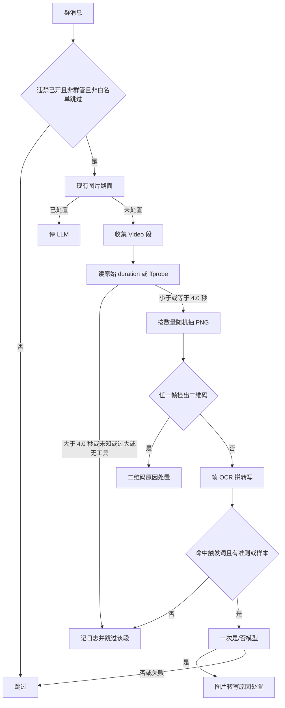

# 短视频抽帧与图片检测测试

Feature Name: forbidden-short-video-image-test
Updated: 2026-10-10

## Description

4.0 秒及以内的 `Video` 段抽最多 3 帧，帧字节进入现有二维码、OCR、触发词和是/否模型顺序。更长、时长未知、文件过大、抽帧工具缺失或超时的视频只记日志，不处置。

控制台新增「图片检测测试」。上传的图走本机 QReader 和 RapidOCR，并展示引擎是否加载。该页不接受前端传入的检出开关。

## Architecture

热路径仍从 `handle_forbidden_message` 进入。图片路保持先跑。短视频只在图片路返回未处置后运行，避免一张图已经命中后又去下载视频。

图片检测测试不进入这条热路径。页面 `apiPost` 到新接口，业务层直接对上传字节做检测计划。

## Components and Interfaces

### 实体层 `entity/constants.py`

新增固定值，并给每个值写明单位和来源：

| 常量 | 值 | 含义 |
| --- | --- | --- |
| `SHORT_VIDEO_MAX_SECONDS` | `4.0` | 含边界。大于此值不抽帧 |
| `SHORT_VIDEO_FRAME_SPLIT_SHORT` | `0.8` | 不足此时长抽 1 帧 |
| `SHORT_VIDEO_FRAME_SPLIT_MID` | `2.0` | 不足此时长抽 2 帧，达到后抽 3 帧 |
| `SHORT_VIDEO_MAX_FRAMES` | `3` | 单段视频帧数上限 |
| `SHORT_VIDEO_SAMPLE_MARGIN` | `0.05` | 随机区间避开首尾各 5% |
| `SHORT_VIDEO_MIN_GAP_RATIO` | `1/6` | 相邻抽帧点的最小间隔占时长比例 |
| `SHORT_VIDEO_RANDOM_TRIES` | `8` | 随机排不开就改等分点 |
| `SHORT_VIDEO_MAX_FILE_BYTES` | `20971520` | 原始段 `file_size` 超过则不下载 |
| `SHORT_VIDEO_TOOL_TIMEOUT_SECONDS` | `8` | 单次 ffprobe 或单帧 ffmpeg 超时 |
| `IMAGE_TEST_MAX_BYTES` | `8388608` | 测试上传解码后字节上限 |

等分兜底点按帧数固定：1 帧为 50%；2 帧为 25%、75%；3 帧为 20%、50%、80%。这些比例也写成具名常量。

### 业务层 `business/forbidden_video.py`

新建文件，只负责短视频抽帧和把帧交给现有图片判定，不直接发 QQ。

- `video_comps(event) -> list`：从 `get_messages()` 收集类型名 `Video` 的段。
- `raw_video_meta(event, index) -> dict`：从原始消息段读取 `duration` 和 `file_size`。组件对象上没有这两个字段，因为 AstrBot `Video` 是 pydantic 模型，额外字段会被丢弃。读不到就返回空。
- `probe_duration_seconds(path, runner=None) -> float | None`：调用 `ffprobe -v error -show_entries format=duration -of csv=p=0`。非数字、小于或等于 0、超时、缺命令都返回 `None`。
- `frame_count_for(duration) -> int`：按 requirements 的两段分界返回 1、2 或 3。
- `pick_timestamps(duration, count, random_fn=None) -> list[float]`：默认用 `random.uniform`。测试注入 `random_fn`。先在 `[duration*0.05, duration*0.95]` 里抽，间隔小于 `duration/6` 就重抽，最多 8 次；仍失败就用等分比例乘时长。
- `extract_png(path, timestamp, runner=None) -> bytes`：`ffmpeg -ss {timestamp} -i {path} -frames:v 1 -f image2pipe -vcodec png pipe:1`。失败返回空字节。不把封面 `cover` 当帧。
- `handle_forbidden_videos(...)`：签名对齐 `handle_forbidden_images` 的处置依赖。返回 `(handled, remind)`。

判定顺序：

1. 没有 `Video` 段，返回未处置。
2. 逐段决定是否抽帧。可抽的段先 `convert_to_file_path()`。这个方法对 http、base64 和本地路径已有实现。插件不删除协议端缓存文件，只删除本功能自己写出的临时帧文件。
3. 全部可抽帧收集完后，按帧顺序调用现有 `qr_found_in_bytes`。第一张命中就走 `apply_hit_actions`，原因 `FORBIDDEN_REASON_QRCODE`，文案沿用 `QRCODE_HIT`。
4. 都未命中时，对非空帧调用现有 `ocr_text_from_bytes`，换行拼接。
5. 用现有 `plan_image_test(config, transcript, False, store)`。`status != ready` 则返回未处置。
6. `ready` 时 `complete_yes_no` 一次。只有 `verdict == yes` 才处置，原因 `FORBIDDEN_REASON_IMAGE_MODEL`，`log_text` 用计划里的用户文本。
7. `_image_user` 现有前缀是「来源: 图片转写」。短视频另写一个同样结构的用户文本，第一行改为「来源: 短视频抽帧」，二维码行仍写「未检出」。能进模型说明前面没有检出码。

`handle_forbidden_message` 在图片路返回未处置后调用 `handle_forbidden_videos`。图片路已处置则不下载视频。

入口层 `main.py` 不新增群消息过滤器。测试接口注册仍放在现有 `_register_forbidden_page`。

### 二维码诊断 `business/forbidden_qr.py`

保留 `qr_found_in_b64` 的布尔语义，热路径继续用它。新增只给测试页和日志用的诊断结果：

- `engine`: `ready`、`missing`、`init_failed`
- `found`: 布尔
- `box_count`: `detect` 返回的元素个数；没有 `detect` 时为 0
- `payloads`: `detect_and_decode` 的非空文本，每条截断到 120 字，最多 3 条
- `error`: 异常时的短原因，不含图片字节

`_load_qreader` 现在导入失败后只把 `_qreader_failed` 设真，热路径随后把未检出和没装库当成同一个 `False`。诊断函数要区分这两种状态。热路径在引擎不是 `ready` 时记录一次 warning，文案包含引擎状态。已有 `_qreader_failed` 仍只尝试加载一次，避免每条消息重复导入。

### OCR 诊断 `business/forbidden_ocr.py`

同样增加诊断返回：`engine`、`text`、`error`。测试页使用它。热路径仍用 `ocr_text_from_bytes`。引擎缺失时现有 warning 保留。

### 测试页业务 `business/forbidden_image.py`

新增 `inspect_uploaded_image(config, store, data, decoder=None, ocr=None, get_provider=None)`。

入参是已解码的图片字节，不接收 `qr_found`。空字节、超过 `IMAGE_TEST_MAX_BYTES`、解码失败都返回错误状态，不调用引擎。

返回给页面的对象含：

- `qr`: 诊断结果
- `ocr`: 诊断结果；gif 在热路径会跳过 OCR，测试页仍跑 OCR，并在 `note` 写明「热路径对 gif 不跑 OCR，本页为核对文字仍识别」
- `trigger`: 命中的触发词，没有则为空
- `plan_status`: `error`、`skip`、`ready`
- `llm_called`: 布尔
- `verdict`: `yes`、`no`、`fail` 或空
- `reason`: 模型第二行，没有则为空
- `message`: 给人看的一句结论

模型只在 `plan_status == ready` 且拿到提供商时调用。提供商缺失时 `llm_called` 为否，`message` 写明当前没有对话提供商，二维码和 OCR 字段仍返回。

### 入口 `main.py`

注册 `POST /{PLUGIN_NAME}/forbidden/image-test`。

请求体是 JSON 对象，字段 `image_base64`。允许带 `data:image/...;base64,` 前缀，入口剥掉后再解码。不是对象、不是合法 base64、解码后超过 8MB，返回 400。成功返回上面的诊断对象。接口不写日志库，不调用 `apply_hit_actions`。

### 页面

`dashboard/src/nav.ts` 增加 `{ key: "forbidden-image-test", label: "图片检测测试" }`，放在 `forbidden-test` 后面。

`dashboard/src/forbidden-image-test-view.tsx`：

- 说明文案写明：结果来自本机 QReader 和 RapidOCR；不会撤回、禁言、发飞书或写日志；旧「违禁测试」页的二维码开关不解码。
- `Upload` 使用 `beforeUpload` 拦截实际上传。只接受 `image/png`、`image/jpeg`、`image/webp`、`image/gif`，且 `file.size <= 8388608`。
- 选择成功后用 `FileReader` 读成 data URL，显示 `img` 预览。
- 「检测」在没有预览或请求进行中时不可用。
- 结果用分项文字展示，不用只丢一段无法区分引擎状态的段落。引擎不是 `ready` 时，二维码区固定显示「二维码引擎未加载，本次未识别」。
- 解码载荷原样展示后端已截断的文本，页面不再拼图片字节进日志。

`App.tsx` 按 key 渲染新视图。改完执行 `cd dashboard && npm run build`，让 `pages/console/` 与源码一致。

## Data Models

不新增表，不改违禁日志列。短视频命中沿用现有原因码：

- 帧上检出二维码：`FORBIDDEN_REASON_QRCODE`
- 转写后模型判定是：`FORBIDDEN_REASON_IMAGE_MODEL`

日志文本在模型命中时保存送审用户文本。二维码命中仍按现有二维码路径保存外层 `message_str`。

图片检测测试的响应不落库。

## Correctness Properties

- 时长比较使用秒，边界包含 4.0。4.01 不抽帧。
- 抽帧数量只由时长分界决定，不由视频分辨率决定。
- 同一条消息的全部短视频帧只产生一次模型调用。
- 二维码命中后不再调用 OCR 和模型。
- 测试接口忽略请求体里的 `qr_found`。即使调用方传入 `true`，结论仍以本机解码为准。
- 引擎不是 `ready` 时，检出必须为否。页面不得把这种结果展示成「已识别且无码」。
- 超时、缺工具、坏视频都不产生违禁处置。
- 白名单、群管、功能未开启这些现有跳过条件对短视频同样生效。

## Error Handling

- `convert_to_file_path` 失败：该段记 `no_file`，继续下一段。
- `ffprobe` 或 `ffmpeg` 不在 PATH：本进程记一次 `tool_missing`，本条及后续短视频都跳过抽帧。
- 命令超时或非零退出：该帧记空，其它帧继续。全部帧都空则当未检出，不处置。
- QReader 或 RapidOCR 缺失：热路径保持现有「当未检出 / 当没字」，并补一次引擎状态日志。测试页返回明确状态。
- 测试上传坏 base64 或超限：400，不启动引擎。
- 模型异常：沿用 `complete_yes_no` 的失败判定，不处置。测试页把 `verdict` 标为 `fail`。

## Test Strategy

单测注入时长、抽帧和随机函数，不依赖本机 ffmpeg、QReader 和真实模型。

短视频：

- 4.0 秒进入抽帧，4.01 秒不进入。
- 时长 `None`、`file_size` 大于 20MB、工具缺失，各自返回未处置并带跳过原因。
- 0.5 秒得 1 个时间点，1.5 秒得 2 个，3.5 秒得 3 个。
- 注入的随机序列间隔过近时，第 8 次后落到等分点。
- 任一帧二维码命中时，OCR 和模型替身不被调用，处置原因是二维码。
- 转写无触发词时不调用模型。
- 转写有触发词且模型返回「是」时只调用一次模型，用户文本以「来源: 短视频抽帧」开头。
- 功能未开启、群管、白名单跳过时不调用抽帧替身。

图片检测测试：

- 注入解码器返回框时，响应 `found` 为真且 `engine` 为 `ready`。
- 注入解码器返回空且引擎可加载时，`found` 为否且 `engine` 仍为 `ready`。
- 引擎缺失时 `engine` 为 `missing`，`found` 为否。
- 请求体同时带 `qr_found: true` 和一张注入为无码的图时，响应仍为未检出。
- 无触发词时 `llm_called` 为否。
- 页面源码含新 Tab 文案、8MB 限制，且不把 `qr_found` 发给 `forbidden/image-test`。
- 构建后的 `pages/console/assets/index.js` 含「图片检测测试」。

检查命令沿用仓库现有入口：`python3 -m unittest`。前端改动再跑 `cd dashboard && npm run build`。本仓没有 ruff 配置时，不把 ruff 写成已通过。

人工核对二维码是否生效：

1. 打开「图片检测测试」，不要用「违禁测试」里的二维码开关。
2. 先上传一张普通截图。引擎状态必须是 `ready`，检出为否。若状态是 `missing` 或 `init_failed`，漏检原因是引擎没加载，不是阈值问题。
3. 再上传一张清晰、占画面足够大的二维码图。`ready` 且检出为是，并能看到框数量或载荷，才说明识别器真的跑过。
4. 若第 2 步是 `ready`、第 3 步仍未检出，把这张漏检图留作后续识别质量问题。本功能不在这一步更换检测库。

## References

[^1]: (Filename#L31) - 现有图片路只收 Image 和表情。 [business/forbidden_image.py](business/forbidden_image.py)
[^2]: (Filename#L38) - 测试计划直接相信调用方传入的 qr_found。 [business/forbidden_image.py](business/forbidden_image.py)
[^3]: (Filename#L252) - 违禁测试接口把 payload 里的 qr_found 传给计划，不解码图片。 [main.py](main.py)
[^4]: (Filename#L288) - AstrBot Video 只有 file、url、cover、path，时长字段不会留在组件上。 [AstrBot components.py](file:///Users/w1ndys/develop/github/AstrBotDevs/AstrBot/astrbot/core/message/components.py)
[^5]: (Filename#L405) - OneBot 未单列的段会用原始 data 构造组件，video 因此成为 Video，但额外字段被模型丢弃。 [aiocqhttp_platform_adapter.py](file:///Users/w1ndys/develop/github/AstrBotDevs/AstrBot/astrbot/core/platform/sources/aiocqhttp/aiocqhttp_platform_adapter.py)
